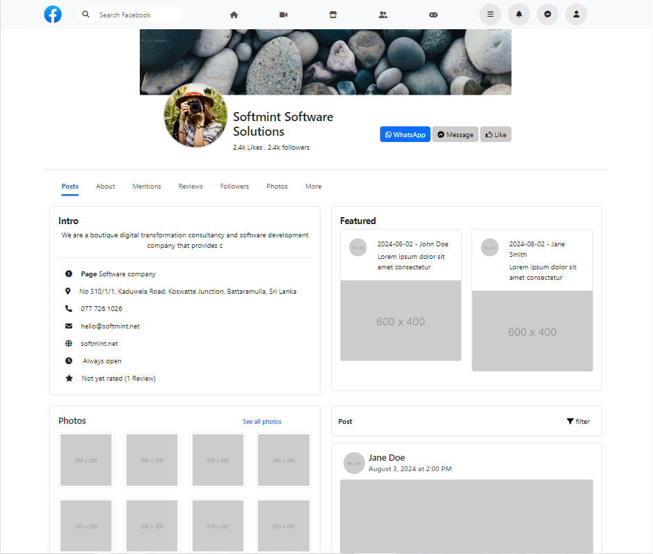

# Facebook Profile Page Clone



A Facebook profile page clone built using React, Vite, and React Bootstrap. This project demonstrates how to create a responsive profile page layout with modern frontend technologies.

## Table of Contents

- [Demo](#demo)
- [Features](#features)
- [Tech Stack](#tech-stack)
- [Installation](#installation)
- [Usage](#usage)
- [Contact](#contact)

## Demo

Check out the live demo of the Facebook Profile Page Clone [here](https://fb-profile-page-clone-react.vercel.app/).

## Features

- Responsive design similar to Facebook profile page
- User profile information
- Photo gallery with "See all photos" link
- Posts section with likes and comments
- Utilizes React Bootstrap for styling and components

## Tech Stack

- **React**: JavaScript library for building user interfaces
- **Vite**: Next generation frontend tooling for faster builds
- **React Bootstrap**: Bootstrap components built with React
- **React Router**: Declarative routing for React applications

## Installation

1. Clone the repository:

   ```bash
   git clone https://github.com/Fazal-dev/fb_profile_page_clone_react.git
   cd fb_profile_page_clone_react
   ```

2. Install dependencies:

   ```bash
   npm install
   ```

3. Start the development server:

   ```bash
   npm run dev
   ```

4. Open your browser and navigate to `http://localhost:3000`.

## Usage

This project can be used as a starter template for building complex profile pages or as a learning resource for React and React Bootstrap.

### Available Scripts

- `npm run dev`: Start the development server.
- `npm run build`: Build the project for production.
- `npm run serve`: Serve the built project.

## Contact

- **Fasal Mohamed**
  - [LinkedIn](https://www.linkedin.com/in/fazalmuhamed/)
  - [GitHub](https://github.com/Fazal-dev)
  - [Email](mailto:mfazal404@gmail.com)
